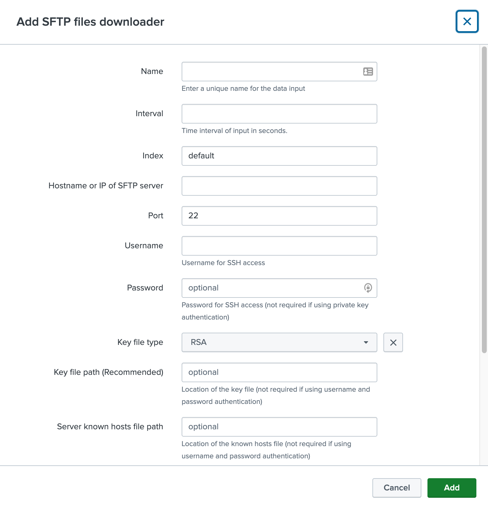

# SFTP files downloader Add-On for Splunk

> The **SFTP files downloader Add-On for Splunk** uses paramiko as a client to connect to an SFTP server and download files to your Splunk instance.

> NOTE: You will have to configure input stanza(s) to ingest your log files
> that were downloaded with this TA. We recommend using the batch input method
> unless you have other log rotation methods.

## Sample Configurations

### username password authentication

> This can be configured in the inputs configuration page or inputs.conf
> It is recommended to use the GUI to configure the inputs. See screenshot below



```
[sftp_files_downloader://sample_source]
destination_file_path = /opt/splunk/etc/apps/TA-sftp-files-downloader/downloaded_files
interval = 3600
key_file_type = RSA
password = ******
port = 22
server_file_path = /upload
ssh_server = 0.0.0.0
username = sftp_user1
disabled = 0
burn_after_download = False
```

### private key and known_hosts authentication

> The known_hosts file and private key file will need to be manually added onto your Splunk server

```
[sftp_files_downloader://sample_source2]
burn_after_download = False
# The destination file path can be anywhere on your server
destination_file_path = /opt/splunk/etc/apps/TA-sftp-files-downloader/downloaded_files
interval = 3600
key_file_path = /opt/splunk/.ssh/private_key
key_file_type = RSA
port = 22
server_file_path = /upload
ssh_server = 0.0.0.0
ssh_server_known_hosts_path = /opt/splunk/.ssh/known_hosts
username = sftp_user1

```

### Sample known_hosts

```
[0.0.0.0]:22 ssh-rsa ...........
```

### Sample conf files for importing the downloaded csv to Splunk

## inputs.conf

```
[batch://$SPLUNK_HOME/etc/apps/your destination file path/*.csv]
index = itd_mecm_hardware_1
move_policy = sinkhole
sourcetype = log:csv
```

## props.conf

```
[log:csv]
FIELD_DELIMITER = ,
HEADER_FIELD_LINE_NUMBER = 1
INDEXED_EXTRACTIONS = CSV
MAX_TIMESTAMP_LOOKAHEAD = 22
TIME_FORMAT = %m/%d/%Y %T
TIMESTAMP_FIELDS = DATE_TIME
TZ = US/Pacific

```

### Installation Instructions

- This Add-on can be installed in **Splunk Enterprise** only. (tested on Splunk v8.2.5 and v9.0)
- This branch is for **Windows** only. (tested on windows server 2022 with cygwin64 installed) For Linux, please use the main branch.
- Please make sure the app folder name is `TA-sftp-files-downloader` (e.g. /opt/splunk/etc/apps/TA-sftp-files-downloader)
- if you see this error: "from cryptography.hazmat.bindings.\_openssl import ffi, lib ModuleNotFoundError: No module named 'cryptography.hazmat. bindings.\_openssl', try the following command:

```
pip uninstall pyopenssl
pip install pyopenssl==21.0.0
```

## Credits & Acknowledgements

- Guo Huang
- Man Pham

## Support

Find us in splunk-usergroups.slack.com
